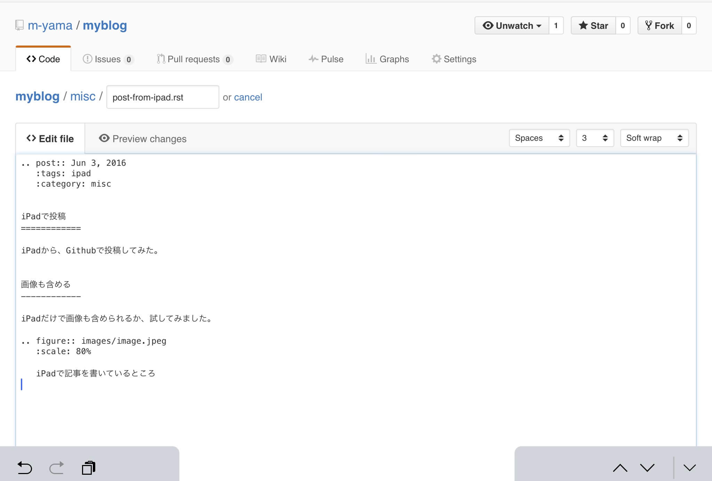

.. post:: Jun 3, 2016
   :tags: blog
   :category: ablog

iPadで投稿
============

iPadから、Githubで投稿してみた。

画像を含める
------------

iPadだけで画像も含められるか、試してみました。

   iPadで記事を書いているところ

一応いけました。
Github上でreSTも確認できるので便利です。

まずは画像を入れるフォルダを作りたかったのですが、Githubでフォルダだけ作る方法が分からなかったので、
いったんファイル作成で適当なファイルを作り、それを images フォルダに入れて作成しました。

ただ、画像をアップロードするときにファイル名を指定するところが見当たりませんでした。
同じファイル名だと上書きされてしまうので、一つのフォルダに複数の画像を入れられません。

何か方法があるのか、後日調べようかと思います。

結論
----

画像のファイル名を変えられるのかどうかは分かりませんが、iPadでも投稿できそうです。
