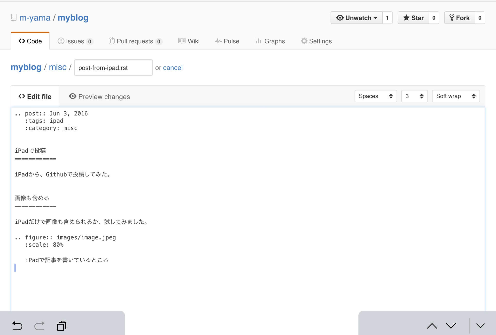

.. post:: Jun 3, 2016
   :tags: ablog, sphinx, github
   :category: blog

Ablogのブログ記事をiPadで投稿
=============================

iPadから、Githubで投稿してみた。

画像を含める
------------

iPadだけで画像も含められるか、試してみました。

   iPadで記事を書いているところ

一応いけました。
Github上でreSTも確認できるので便利です。

まずは画像を入れるフォルダを作りたかったのですが、Githubでフォルダだけ作る方法が分からなかったので、
いったんファイル作成でダミーファイルを images フォルダ配下に作成しました。

ただ、画像をアップロードするときにファイル名を指定するところが見当たりませんでした。
同じファイル名のファイルを追加すると上書きされてしまうので、あとから画像を追加できません。
何か方法があるのか、後日調べようかと思います。

ちなみに、iPad Pro 9.7 (iOS9.3.2) と Microsoft Universal Mobile Keyboard の組み合わせで書きました。

あと、スクリーンショットをとると画像のサイズがRetinaサイズになってしまって少し大きいので、TinyJPG で圧縮してからアップロードしました。画像リサイズ系のアプリを使ってもいいかもしれませんが、アプリを探すのが面倒だったのでとりあえず圧縮だけしました。

あと、スクリーンショットはデフォルトではPNGですが、少しトリミングしてあるので、JPEGになってます。

結論
----

画像のファイル名を変えられるのかどうかは分かりませんが、iPadでも投稿できそうです。
