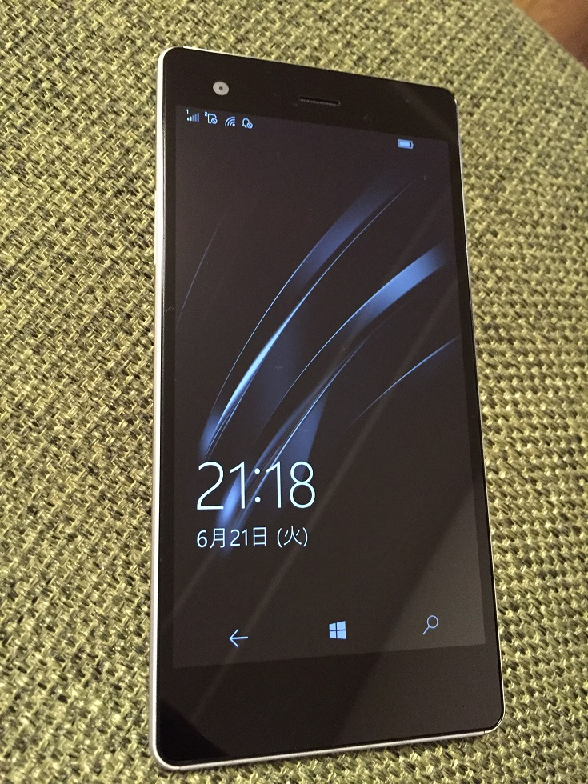

.. post:: Jul 17, 2016
   :tags: gadget, smartphone
   :category: blog

VAIO Phone Bizを購入した話
==========================

|img-front| |img-back| |br|
VAIO Phone Biz を買って１ヶ月ほど経ったので、簡単に感想を書いてみたいと思います。

.. |br| raw:: html

    

.. |img-back| image:: images/vaio-phone-biz-back.jpg
   :scale: 20%

といっても、ほとんどWiFiルーター替わりぐらいにしか使ってないので、
大して書けることはありませんが・・・

良かった点
----------

* 見た目より軽い
* Windows Phone の中ではデザインがカッコいい

残念だった点
------------

テザリング（モバイルホットスポット）時に、Kindle端末（Fireではなく、電子ペーパーの方）から接続できませんでした。

KindleからVAIO Phone BizにWiFi接続しようとすると、
Windows 10 Mobile の設定アプリが「再読み込み」と表示されたままフリーズした感じになり、
まったく操作できなくなります。

しばらくすると復活しますが、何度試してもKindleから接続できません。

ちなみに、Freetelの KATANA01 でも試したところまったく同じ現象になったので、
VAIO Phone Biz によるものではなく Windows 10 Mobile に問題があるのだと思います。

iPhoneのテザリングには接続できるので、Windows 10 Mobileでも接続できるよう対応してもらいたいものです。

という、個人的愚痴を書きたいだけでした。

