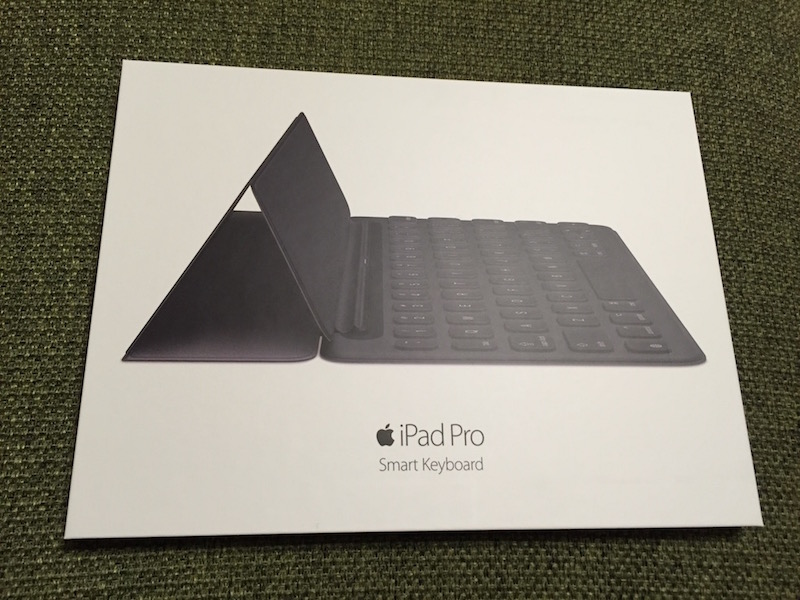
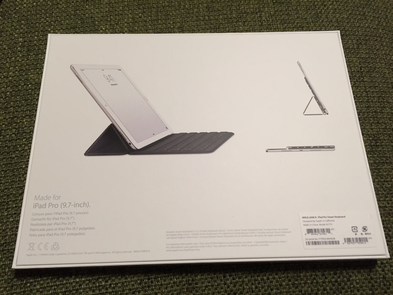
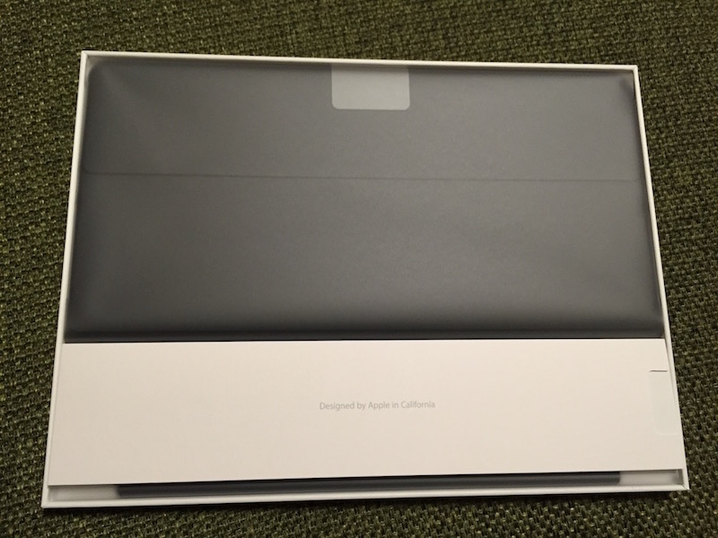
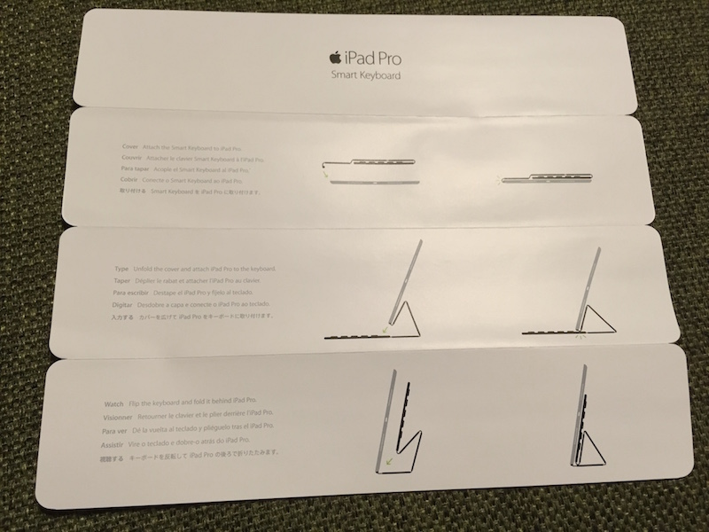
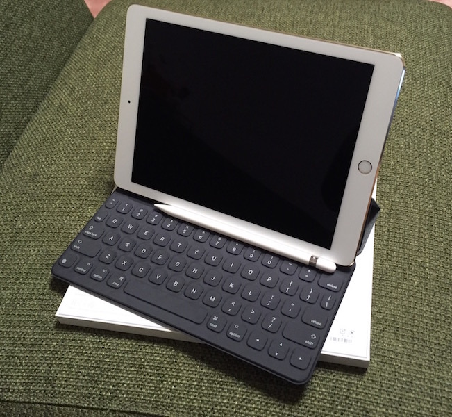
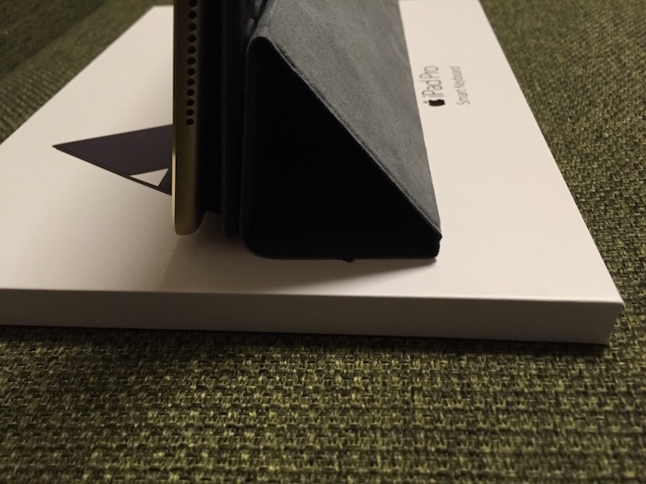

.. post:: Sep 11, 2016
   :tags: blog
   :category: gadget
   :image: 0

Smart Keyboard をゲットだぜ！
=============================

 iPad Pro 9.7を買ってから今まではキーボードにMicrosoftのUniversal Mobile Keyboardを使っていましたが、やはりキーボードとiPadと2つのデバイスを持ち歩くのが煩わしく感じてきたので、先月あたりからSmartKeyboardが欲しくなってきました。

しかしやはり、16,800円という金額に中々手が出せずにいましたが、もしかするとアップルのイベントで何かあるかもしれないと思って待っていると、新キーボードはありませんでしたが、なんとSmartKeyboardの値段が下がっているではありませんか！（千円だけですが）

で、我慢できずにぽちりました。

|package01| |package02|

開封の儀
--------

   箱を開けるとこんな感じ

   マニュアルが付いてます

   ついに三種の神器が揃いました

.. figure:: images/thickness.jpg
   :align: center
   :width: 400px

   厚さはこんな感じです

事前に某量販店で展示品を触って使用感は分かっていましたが、自分のiPadに装着するとやはりテンションが上がります。
レビューは色んなサイトで書かれているので書きませんが、他のサイトで書かれていなかった点をいくつか。

視聴スタイルにした時に不安定？
------------------------------

視聴スタイルにした場合に角度がほぼ直立になって不安定、すぐ倒れる、みたいなレビューがいくつかありました。おそらく下の写真のような感じだと思います。

しかし、カバーの折り目の部分を下の写真のような感じに折って型を付ければ、角度ができて安定します。

.. image:: images/stand02.jpg
   :width: 400px

ショートカットキー
------------------

アプリで使えるショートカットキーはコマンドキーはコマンドキーは長押しで表示できますが、表示されないものもあります。

Safariでは以下のショートカットも使えます。

.. list-table::

   * - 下にスクロール
     - | option + ↓
       | または
       | Space
   * - 上にスクロール
     - | option + ↑
       | または
       | Shift + Space

まとめ
------

事前に重さやタイプした感じなどの使用感が分かっていたこともあり、概ね満足しています。

ただやはり、言語の切り替えは少し面倒です。
Microsoft Universal Mobile KeyboardではMacと同じように英数・かなキーで英語と日本語を切り替えられたのですが、Smart Keyboardでは地球儀キーでトグルする形式なので、タイプして言語が違う->切り替える、という一手間があります。ちょうど、Windowsの半角・全角キーと同じです。（ちなみに私はWindowsでも無変換・変換をIMEオン・オフに変更してMac風の言語切り替えにしていますが）

なにより、別途キーボードを持ち運ばなくても、基本的にカバーとして常に装着して、使いたいときにいつでもキーボードが出せる、というのがスマートでいい感じです。

この投稿も、草稿はiPad Proの「メモ」アプリを使ってSmartKeyboardで作成し、iCloudでMacのメモアプリに同期して、細かい部分をMacで仕上げました。何かを作るのにわざわざMacを開かなくても、iPadでささっと作って、仕上げはMacで、ってのが今後のスタイルになりそうです。

