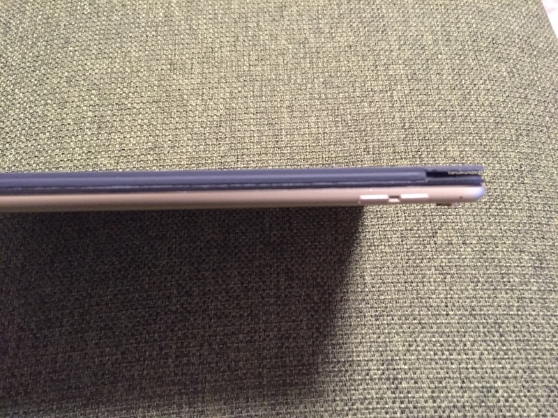
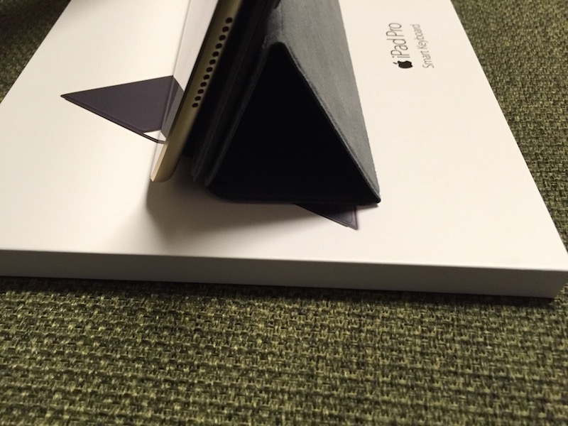
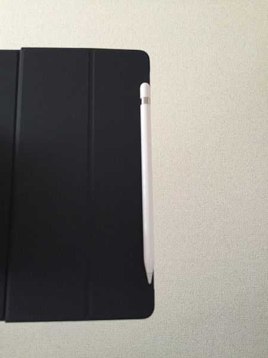
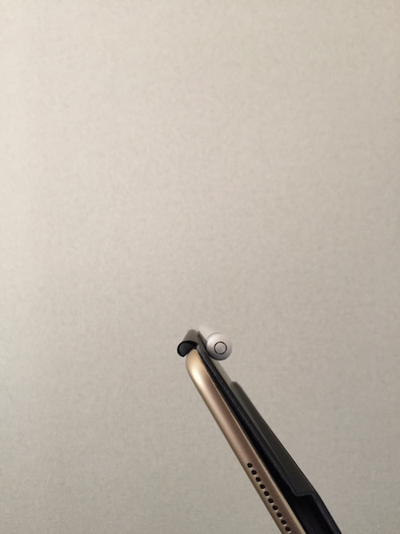
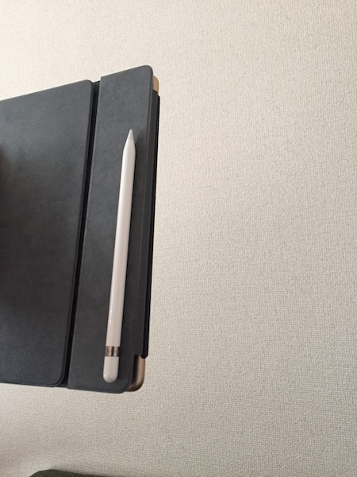

.. post:: Sep 11, 2016
   :tags: gadget, keyboard
   :category: blog

今さらSmart Keyboardを購入した話 
================================

|img1| |img2| |br|
iPad Pro 9.7を買ってから今まではキーボードにMicrosoftのUniversal Mobile Keyboardを使っていましたが、やはりキーボードとiPadと2つのデバイスを持ち歩くのが煩わしく感じてきたので、先月あたりからSmartKeyboardが欲しくなってきました。

.. |br| raw:: html

    

.. |img2| image:: images/package02.jpg
   :scale: 20%

しかしやはり、16,800円という金額に中々手が出せずにいましたが、もしかするとアップルのイベントで何かあるかもしれないと思って待っていると、新キーボードはありませんでしたが、なんとSmartKeyboardの値段が下がっているではありませんか！（千円だけですが）

で、我慢できずにぽちりました。

.. contents::
   :local:

開封の儀
--------

.. figure:: images/open.jpg
   :align: center
   :width: 400px

   箱を開けるとこんな感じ

   マニュアルが付いてます

   ついに三種の神器が揃いました

   厚さはこんな感じです

事前に某量販店で展示品を触って使用感は分かっていましたが、自分のiPadに装着するとやはりテンションが上がります。
レビューは色んなサイトで書かれているので書きませんが、他のサイトで書かれていなかった点をいくつか。

視聴スタイルにした時に不安定？
------------------------------

視聴スタイルにした場合に角度がほぼ直立になって不安定、すぐ倒れる、みたいなレビューがいくつかありました。おそらく下の写真のような感じだと思います。

.. image:: images/stand01.jpg
   :width: 400px

しかし、カバーの折り目の部分を下の写真のような感じに折って型を付ければ、角度ができて安定します。

ショートカットキー
------------------

アプリで使えるショートカットはコマンドキー長押しで表示できますが、表示されないものもあります。

Safariでは以下のショートカットも使えます。

.. list-table::

   * - 下にスクロール
     - | option + ↓
       | または
       | Space
   * - 上にスクロール
     - | option + ↑
       | または
       | Shift + Space

また、その他以下のようなショートカットもあります。

.. list-table::

   * - 言語切り替え
     - | control + Space
       | caps lock (iOS10以降)

まとめ
------

事前に重さやタイプした感じなどの使用感が分かっていたこともあり、概ね満足しています。

ただやはり、言語の切り替えは少し面倒です。
Microsoft Universal Mobile KeyboardではMacと同じように英数・かなキーで英語と日本語を切り替えられたのですが、Smart Keyboardでは地球儀キーでトグルする形式なので、タイプして言語が違う->切り替える、という一手間があります。ちょうど、Windowsの半角・全角キーと同じです。（ちなみに私はWindowsでも無変換・変換をIMEオン・オフに変更してMac風の言語切り替えにしていますが）

.. update:: Sep 17, 2016
   
   iOS10にアップデートしたところ、caps lockキーでも言語の切り替えができるようになりました。caps lockキーはちょうど左手小指の位置にあるため地球儀キーより押しやすく、言語切り替えの煩わしさが半減しました。

なにより、別途キーボードを持ち運ばなくても、基本的にカバーとして常に装着して、使いたいときにいつでもキーボードが出せる、というのがスマートでいい感じです。

この投稿も、草稿はiPad Proの「メモ」アプリを使ってSmartKeyboardで作成し、iCloudでMacのメモアプリに同期して、細かい部分をMacで仕上げました。何かを作るのにわざわざMacを開かなくても、iPadでささっと作って、仕上げはMacで、ってのが今後のスタイルになりそうです。

余談ですが、カバーの左右に付いている磁石の部分で、転がりやすいApple Pencilをこんな感じでくっつけておくこともできます。

|pencil01| |pencil02| |pencil03| |pencil04|

.. |pencil03| image:: images/pencil03.jpg
   :scale: 30%

