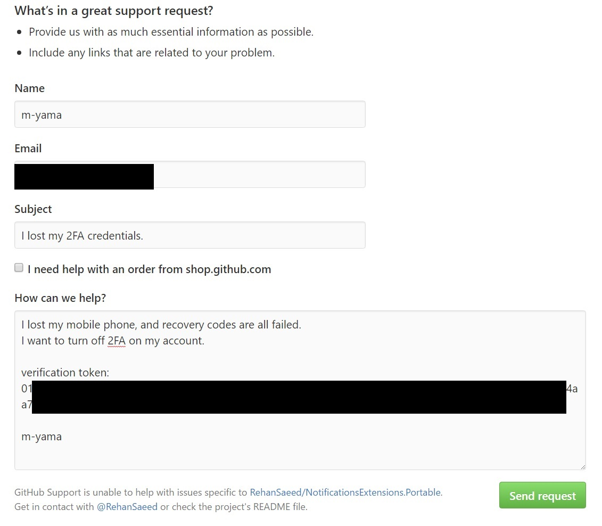
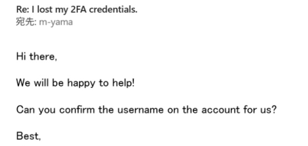
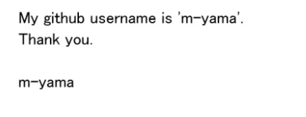

.. post:: 29 Aug, 2016
   :tags: github, 2FA 
   :category: blog

Githubにサインインできなくなった話
==================================

先日、携帯電話を機種変更したときに、
Githubの2要素認証をオンにしたまま前のケータイを初期化してしまい、
Githubにログインできなくなってしまいました。

なんとか復活できたので手順を記しておきます。

参考
----

以下のサイトを参考にしました。

`How to recover your GitHub account if you lost your 2FA credentials AND recovery codes. <https://medium.com/@kaumac/how-to-recover-your-github-account-if-you-lost-your-2fa-credentials-and-recovery-codes-d171b2bb87f0#.qkn7ozuwd>`_

ちなみに、事前にGithubにSSHキーを登録しておく必要があるので、
登録していない人は諦めてください。

.. image:: images/github_sshkey.jpg

サポートとのやり取り
--------------------

Githubのサポートサイトから、以下のリクエストを送りました。
（機種変更したとか説明が面倒なので、ケータイを失くしたってことにしておきました）

すると、こんなリプライが。

ということで、次のように返信。

すると、次のように2要素認証を解除していただけました。

.. image:: images/github_reply_3.jpg
   :align: center

リカバリーコードをダウンロードしてくださいとか、
電話番号を登録しておくと電話があれば復活できるよ（電話失くしたって書きましたが・・）、
とか色々と定型文のように書かれているあたりを見ると、
こういったサポートはよくあるのでしょうか。

以上、Githubで2要素認証できなくなった時の認証解除法でした。

