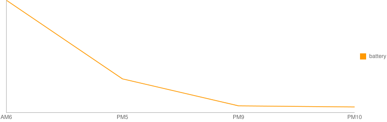
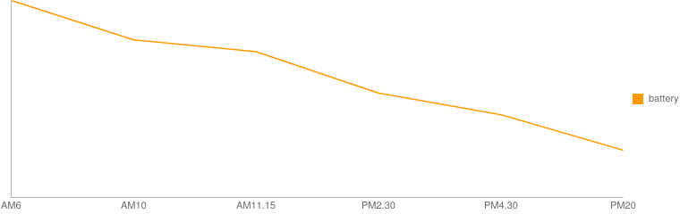
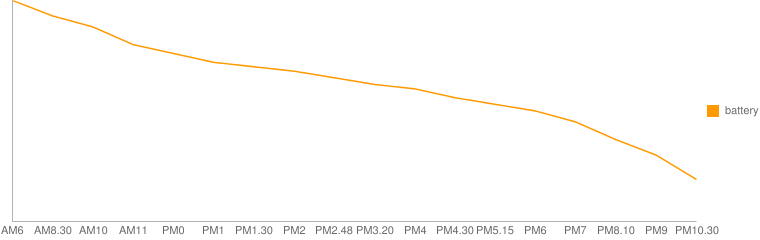
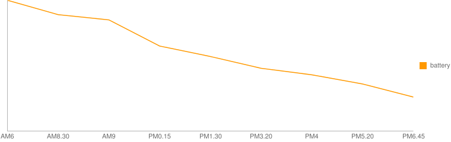
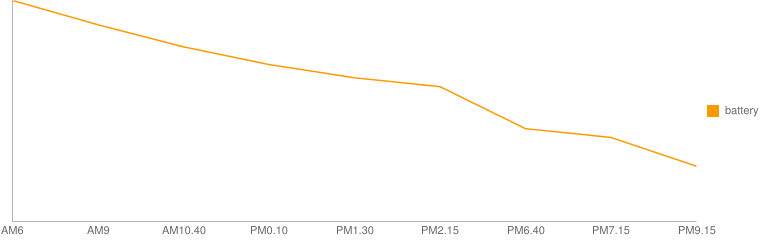
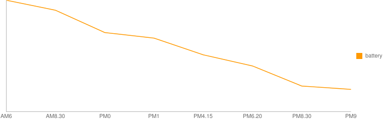
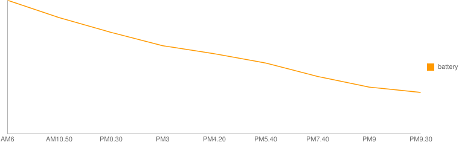

.. post:: Feb 20, 2017
   :tags: gadget, smartwatch
   :category: blog

.. _post-feb20-2017:

Zenwatch3のバッテリー持続時間が短い件
=====================================

先日、ASUSのZenwatch3を購入したが、買った当初バッテリーの持続時間が思った以上に悪く、
一日どころか夕方にはバッテリーがなくなりそうな状態になってしまっていた。

しかし、どうやら始めはバッテリーが不安定で、
バッテリーサイクルが安定するまでには数日かかるものらしい。
（もしかするとスマートフォンでもそうなのかもしれない）

https://forum.xda-developers.com/zenwatch-3/help/battery-life-real-bad-t3506927

実際、充電→放電を繰り返すうち、少しづつ改善している。
また、前日の晩にシャットダウンや再起動をした方が、
翌日のバッテリーの持ちがいい気がする。
一応、丸一日は持つようになってきたが、２日は持たない。
常時表示をOFFにしたり、手首を傾けて表示するのをOFFにすれば２日持つようになるかもしれないが、
そうすると時間をすぐに確認できなくなり、時計の役割を果たさなくなるため、
利便性優先で考える。

ちなみにiPhoneで使用しているが、iOSのBluetooth周りの不具合のせいか、
接続が頻繁に切れるのが困る。

.. update:: Mar 11, 2017

   Androidで使用した場合について記載。

   :ref:`post-mar11-2017`

バッテリー残量に関する記録
^^^^^^^^^^^^^^^^^^^^^^^^^^

* 通知は１時間に１つぐらいで、少しずつ設定を変えながらバッテリーの持ちを観測。
* 気が向いたときにバッテリー残量を確認したため、時間はバラバラ。

（2日目）
---------

   :エコモード: OFF
   :明るさ: 1
   :常時表示: ON
   :傾けてスリープ解除: ON
   :手首の操作: ON
   :位置情報: 常に許可
   :GoogleNow: ON
   :ウォッチフェイス: Circular
   :AsusZenfit: 使用
   :Google Fit: OFF

.. csv-table::
   :stub-columns: 1

   時間, 6:00, 17:00, 21:00, 22:00
   残量,	100%,   30%,    6%,   5％

※21時時点でバッテリーセーバー起動中

（3日目）
---------

   :エコモード: OFF
   :明るさ: 1
   :常時表示: ON
   :傾けてスリープ解除: OFF
   :手首の操作: OFF
   :位置情報: 常に許可
   :GoogleNow: OFF
   :ウォッチフェイス: ダッシュボード
   :AsusZenfit: 通知をブロック
   :Google Fit: OFF

.. figure:: images/day3.png
   :align: left

.. csv-table::
   :stub-columns: 1

   時間, 6:00, 8:30, 10:00, 12:00, 17:00, 18:00, 19:00, 20:00 
   残量, 100%,  90%,   80%,   68%,   35%,   30%,   20%,   13%      
 
**※３日目の夜、一度ペアリングを解除（Factory Reset）**

（4日目）
----------

   :エコモード: OFF
   :明るさ: 自動
   :常時表示: ON
   :傾けてスリープ解除: ON
   :手首の操作: ON
   :位置情報: 常に許可
   :GoogleNow: OFF
   :ウォッチフェイス: Lux Copper
   :AsusZenfit: 通知ブロック

.. csv-table::
   :stub-columns: 1

   時間, 6:00, 10:00, 11:15, 14:30, 16:30, 20:00
   残量, 100%,   80%,   74%,   53%,   42%,   24%

（5日目）
---------

   :明るさ: 1

   他の設定は前日と同じ

.. csv-table::
   :stub-columns: 1

   時間, 6:00, 8:30, 10:00, 11:00, 12:00, 13:00, 13:30, 14:00, 14:48, 15:20, 16:00, 16:30, 17:15, 18:00, 19:00, 20:10, 21:00, 22:30
   残量, 100%, 93%, 88%, 80%, 76%, 72%, 70%, 68%, 65%, 62%, 60%, 56%, 53%, 50%, 45%, 37%, 30%, 19%

（6日目）
----------

   :ウォッチフェイス: Circular

   他の設定は前日と同じ

.. csv-table::
   :stub-columns: 1

   時間, 6:00, 8:30, 9:00, 12:15, 13:30, 15:20, 16:00, 17:20, 18:45
   残量, 100%, 89%, 85%, 65%, 57%, 48%, 43%, 36%, 26%

**※一度、端末を再起動**

（7日目）
-------------

   :明るさ: 1

   他の設定は前日と同じ

   **前日再起動あり**

.. csv-table::
   :stub-columns: 1

   時間, 6:00, 9:00, 10:40, 12:10, 13:30, 14:15, 18:40, 19:15, 21:15
   残量, 100%, 89%, 79%, 71%, 65%, 61%, 42%, 38%, 25%

（8日目）
----------------

   :Google Now: OFF

   **前日再起動なし**

.. figure:: images/day8.png
   :align: left

.. csv-table::
   :stub-columns: 1

   時間, 6:15, 8:30, 12:10, 18:20, 19:50, 21:00
   残量, 100%, 86%, 66%, 34%, 26%, 19%

**※一度、端末を再起動**

（9日目）
----------------

   前日と同じ

   **前日再起動あり**

.. csv-table::
   :stub-columns: 1

   時間, 6:00, 8:30, 12:00, 13:00, 16:15, 18:20, 20:30, 21:00
   残量, 100%, 91%, 71%, 66%, 51%, 41%, 23%, 20%

**※一度、端末をシャットダウン**

（10日目）
----------------

   設定は前日と同じ

   **前日シャットダウン**

.. csv-table::
   :stub-columns: 1

   時間, 6:00, 10:50, 12:30, 15:00, 16:20, 17:40, 19:40, 21:00, 21:30
   残量, 100%, 87%, 76%, 66%, 60%, 53%, 43%, 35%, 31%

最後に
------

10日目以降は似たような結果。
バッテリー持続時間は、画面常時表示ON・手首を傾けて表示ONで、
特に操作しなければ約20時間ぐらいといったところ。

しかし、たまにバッテリーの減りが早くなる時があるため、
そういう時はペアリング解除してリセットしたりしている。
Android Wear 2.0 になって安定してくれることを祈る。

