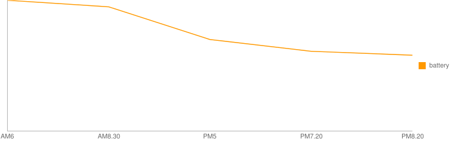
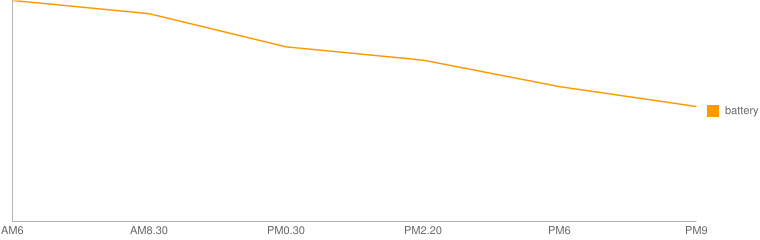

.. post:: Mar 11, 2017
   :tags: gadget, smartwatch
   :category: blog

.. _post-mar11-2017:

Zenwatch3をAndroidに接続したらバッテリーが長持ちした
====================================================

Zenwatch3をAndroidケータイに接続して使用すると、iPhoneで使用した場合に比べて、バッテリー持続時間が大幅に向上した。

バッテリー残量に関する記録
^^^^^^^^^^^^^^^^^^^^^^^^^^

先日の、 :ref:`post-feb20-2017` では、iPhoneに接続して使用した場合にバッテリーがあまり持たないという結果だったが、Androidケータイ(docomo SC-01F Galaxy Note 3) に接続して使用すると、かなり長持ちした。

（1日目）
----------

   :googleフィード: オフ
   :明るさ: 1

   その他の設定はデフォルトのまま。

.. csv-table::
   :stub-columns: 1

   時間, 6:00, 8:30, 17:00, 19:20, 20:20
   残量, 100%, 95%, 70%, 61%, 58%

（2日目）
----------

   * 設定は前日と同じ
   * 前日再起動なし

.. csv-table::
   :stub-columns: 1

   時間, 6:00, 8:30, 12:30, 14:18, 18:00, 21:00
   残量, 100%, 94%, 79%, 73%, 61%, 52%

所感
^^^^

二日しか計測していないが、明らかに違う。

原因はよくわからないが、iPhoneではBluetooth接続が頻繁に切れるため、再接続するための処理により電力消費が増えたのかもしれない。

