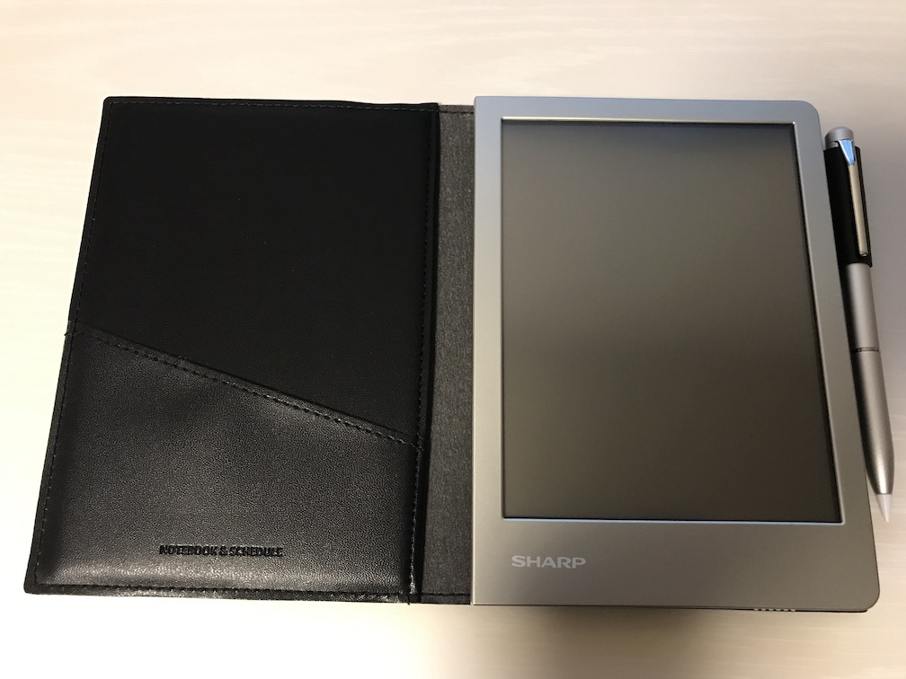
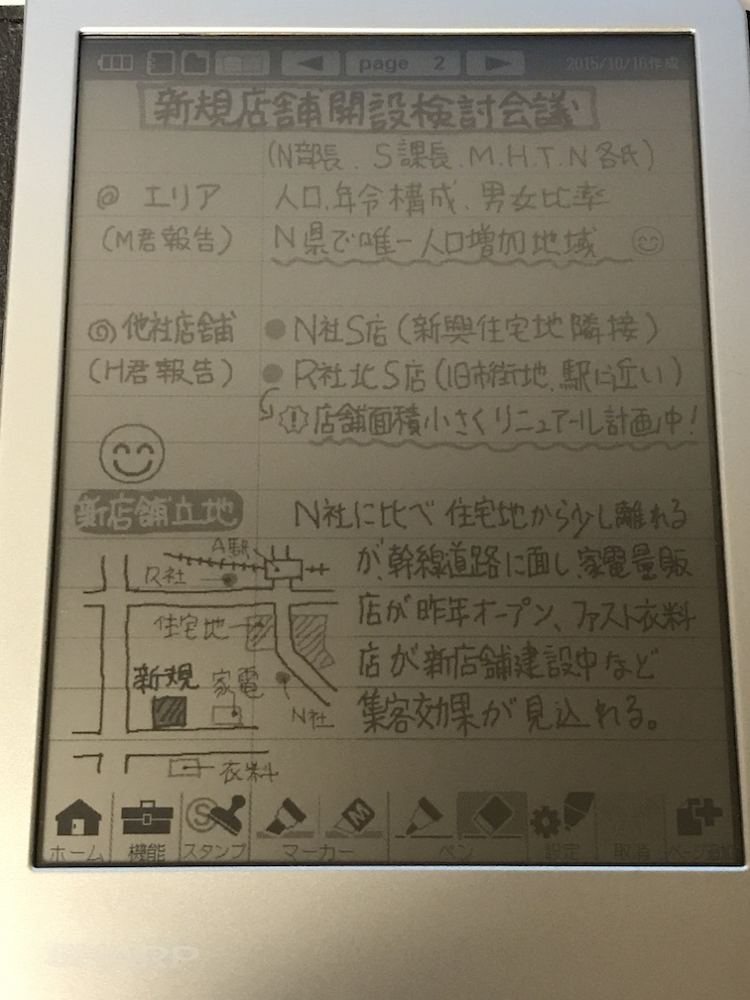
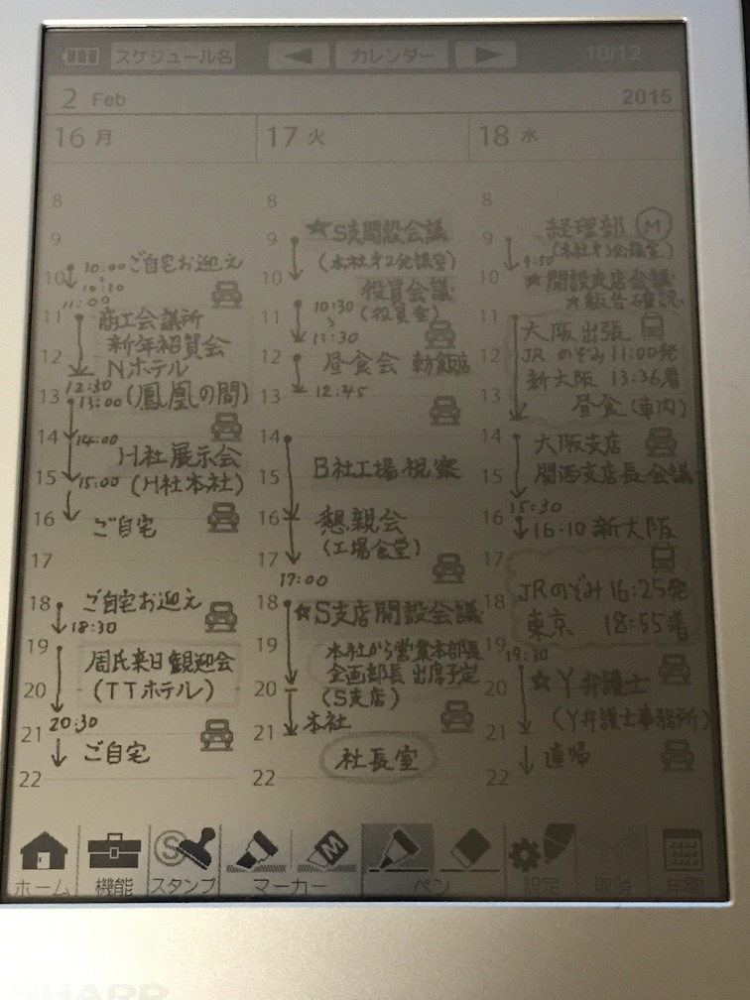

.. post:: Jul 16, 2017
   :tags: gadget
   :category: blog

シャープの電子ノートを買った話
==============================

|img| |br|
今更ながら、シャープの電子ノート「WG-S30-B」を購入した。2年も前に発売された端末。

.. |br| raw:: html

    

|image2| |image3| |image4|

.. |image3| image:: image/image3.jpeg
   :scale: 25%

購入に至った経緯
----------------

もともと、勉強用のノート代わりになるデバイスを探していた。紙のノートを買うのが一番手っ取り早いのはその通りだが、そこはガジェット好き人間。デジタルかつ手書きができるデバイスを探した。

基本的に手を動かすのが目的で、あとで読み返すことは無いのでブギーボードでいいかと最初は思ったが、どうせなら保存したりパソコンに取り込んだりできる方がいいなーと思い、色々探したところ、思ったようなことができるのがこの端末だった（というか、これしかなかった）。

また、ブギーボードだと画面の範囲内しか書けないので、収まりきらなかった場合にどうしようもない。例えば問題集なんかを解いていると、設問が何十問もあると一画面に回答を書き切るのが不可能な場合がある。その点、電子ノートであれば次のページを追加して、またさっきのページに戻って、といったことができる。本製品のレビュー記事なんかを見ていると、「液晶が暗い」「カット＆ペーストできない」といったネガティヴなレビューもちらほら見かけられたため、新モデルの情報があれば待ちたいところだったが、今の所その様子はなさそうなので、販売終了する前に買っておいた。

.. update:: Dec 6, 2017

   と思っていたら、（まさかの）後続機（WG-S50）が発売されていた。
   選択範囲のカット・コピーができるようになったらしい。
   しかし、画面が暗いのと解像度の低さはそのままのよう。。

購入に際して
------------

レビュー等々で不安だったのが『液晶の暗さ』。確かにゲームボーイなど昔のデバイスを思い出せばそんなものだと思うが、スマホやタブレットになれてしまった今、その暗さが許容範囲かどうか心配だった。

それだけでも事前に確認しておきたいと思い、まさかこんな古い端末の実機展示なんか置いてないだろうと思いながも、ダメ元で近所の家電量販店に行ってみたところ、奇跡的に実機が電子辞書コーナーに置いてあった。展示されていた実機に添えてあったペンは純正ではなく、他の電子辞書用のものらしき黒くて小さくて極細のペンが挿さっていたため、実際のペンでの書き心地は確認できなかったが、とりあえず画面の確認はできた。確かに暗いし、蛍光灯が反射した部分は全く見えない。正直、見づらかった。ただ、書き心地は紙のノートのように書きやすく、字の見た目や操作性などもいい感じだったので、反射防止シートも合わせて買うことにした。

後日反射防止シートが届いたが、反射防止シートをつけてもあまり変わらなかったのと、貼るのに失敗して埃やらゴミが入り込んでしまったので、結局剥がしてしまった。照明にもよるが、画面の角度に気をつければ結構見れるので、このままフィルムなしでいこうと思う。慣れればそんなに見づらくなくなってくると思う。

購入後の所感
--------------

Bluetoothでファイル転送ぐらいはできるようにして欲しかった。電子ノートで書いた内容は画像に書き出して他のデバイスに連携できるようになっているが、他のデバイスに連携する時はUSBケーブルで接続する必要がある。microUSBのAndroidスマホがあれば直接接続してファイルマネージャーアプリでファイル連携できるが、現在使っているメイン端末はiPhoneなので、連携できない。基本的にはノートや一時的なメモぐらいしか書かないが、もし連携したいものがあればiPhoneで撮影するか、素直にPCとUSBで接続するか。

あと、以下の点が不満に思った。

   * 複数ページ選択して一括コピーまたは移動したい。
   * スケジュール帳の土日の欄が小さいので、平日と同じ大きさにして欲しい。
   * 月間カレンダーを標準で入れておいて欲しい。
   * フォーム登録できる最大数が少ない（９種類）。

しかし、紙のような書き味には満足している。感圧式パネルの上に摩擦抵抗があるフィルムが貼られているような感じで、ペンを滑らせると紙のような抵抗がある。しかしそこは感圧式パネルなので、紙とは違って画面にかけるペン圧を微妙に調整する必要があるが、すぐに慣れてくる。

スマホやタブレットであれば何か書こうと思ってもアプリを起動したりノートを作ったりするのに数ステップ踏む必要があるが、電子ノートは書こうと思った時にすぐ書ける感じがいい。それに、ペン対応を謳っているタブレットは少ないし、スマホだとGalaxy Noteしかない。個人的に静電発生式のスタイラスはあまり好きではない。画面にペン先が当たった時に結構大きめにコツコツと音がなるし、電池が切れたら急に書けなくなるし、たまに線が飛んだりしてストレスが溜まる。

手書きデバイスを求めて
-----------------------

過去に、手書きデバイスを追い求めて以下のようなものを購入した。

   * Every Pad Pro と Dell ActiveStylus
   * ASUS Transbook mini T102HA
   * Galaxy Note 3 (docomo SC-01F)
   * Galaxy Note 10.1 2014 Edition
   * Surface Pro 3
   * iPad Pro 9.7 と Apple Pencil
   * その他、静電式スタイラスをいくつか（アマゾンで検索して上位に出てくるやつ三本ほど）

個人的な評価の基準は、家や電車内での勉強に使えるかどうか。具体的には、Kindleアプリで参考書を表示しながらノートを書けるかどうか。

その要望を満たしてくれるデバイスは今のところ、Galaxy Note 10.1 2014 だけ。Samsung用にカスタマイズされたKindleがあり、Galaxy Note であれば画面分割して左側にKindle、右側に OneNote を表示できる。端末の重量も500グラム台なので、ギリギリ片手で持っていられる。

次に、Every Pad Pro。これもなかなか良かったが、８インチなので電子書籍リーダーとノートアプリを切り替えるかウィンドウサイズを調整する必要があるのと、ペンのボタンを押して消しゴムモードにしたい時に若干ラグがあり、すぐに消せないのがややストレス。

Transbook mini もいいが、ディスプレイサイズの割に解像度が低いのが残念。あと、Every Pad Pro と同じくCPUがAtomなので、アプリの起動や動作がモタつく。

家で使う分には Surface Pro 3 が素晴らしい働きをしてくれるが、残念ながら電車で片手に持ちながら勉強という訳にはいかない。

iPad Pro と Apple Pencil は、書いた時の滑らかさはさすがだが、Kindelアプリがスプリットビューに対応していないので参考書を表示しながらノートを書く、というのができない。かろうじて Kindle Cloud Reader を左側３分の２に表示して、右側３分の１に OneNote を表示することはできるが、ノートの面積が狭いので書きにくい。

Galaxy Note 3 は手軽さでは一番だが、如何せん画面が小さいので勉強には向いていない。 

静電式スタイラスは前述の通り。

結局
-------

電子ノートは書くことに特化している分、スマホやタブレットほど多機能ではないが、紙のような書き心地や快適な操作感が得られる。

とは言うものの、この投稿の下書きは、スキマ時間にiPhoneのメモアプリで書き、iCloud経由でMacに連携して仕上げた。やはりクラウド連携便利。さすがに電子ノートに手書きで書いて、それを見ながらキーボードで打ち込むなんていう面倒なことは出来ない。それに、電子ノートのスケジュール帳は使わなそう。その辺はスマホの方が便利。スマホならスケジュールの日付変更が簡単にできたり、リマインドしてくれたりする。

ということで、電子ノートのいいところと、スマホやタブレットのいいところを使い分けながら生きていきたいと思います。

.. update:: Jul 24, 2017

   スケジュール帳は使わないと思ったが、せっかく買ったし、普段あまり計画的に行動できていないと思っていたので活用してみることにした。手帳術に関するサイトをいくつか見て、良さそうなのを実践してみる。

   そこで思ったが、やはりスケジュール管理も紙の方が優れているかもしれない。確かに手帳に書くと手帳でしか見れないし、変更があった時に書き直すのが面倒というデメリットはあるが、紙の方が書くときの柔軟性に優れている。

   例えば、スマホならキーボードで書ける文字しか書けないが、手書きなら頭文字だけ書いて◯で囲むとか、吹き出しを書いてメモとか、線を引くとか、思ったことを自由に書ける。また、カレンダーアプリなら時間を指定して「何時から何時」といった入力をしなければならないが、手書きであれば線を引くだけで済む。試しに１週間分の行動をスケジュールに書いたが、２〜３分で書き終えた。スマホなら１０分はかかったかもしれない。

   これであともう少し解像度が高くて、画面が明るくて、カットorコピー＆ペーストできて、直線が引けたら・・・

最後に
---------

iPhoneのメモアプリで長文を書いていて思ったが、iOSの日本語変換があまり優秀じゃないのがかなりストレス。これが理由で、次にケータイを買い替えるときはAndroidにしたいと思う。

