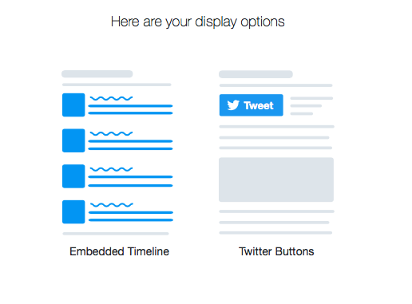
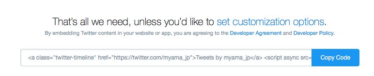
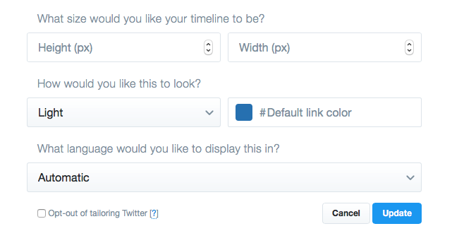

.. post:: Aug 11, 2017
   :tags: twitter, sphinx, ablog
   :category: blog

サイドバーにツイッターのタイムラインを埋め込む
==============================================

Sphinxで書いているこのブログのサイドバーに、ツイッターのタイムラインを埋め込んだので手順をまとめておく。

埋め込むコードを取得する
-------------------------

1. 自分のTwitterページのURLをコピー

2. https://publish.twitter.com/ にアクセスし、
   先ほどコピーしたURLを貼り付け

.. figure:: images/image2.png
   :width: 400px
   :align: center

3. 形式は *Embedded Timeline* を選択

4. *Copy Code* ボタンを押すと、埋め込むHTMLがクリップボードに登録される。

5. *set customization options* のリンクを選択すると、
   高さや幅などを設定することができる。

サイドバーにテンプレートを追加する
----------------------------------

1. ``_templates`` ディレクトリにHTMLファイルを追加し、先ほど取得したコードを貼り付ける。

   .. code-block:: html

      

        <a class="twitter-timeline" data-height="680" href="https://twitter.com/myama_jp">Tweets by myama_jp</a> 
      

   - 高さを680pxに設定した。
   - 上側の余白を調整したかったのでdivタグで囲んだ。

2. *conf.py* の ``html_sidebars`` に、作成したHTMLファイルのファイル名を追加する。

   ↓の場合は *twitter.html* が追加したHTMLファイルの名前

   .. code-block:: python

      html_sidebars = {
          '**': [ 'about.html',
                  'postcard.html', 'navigation.html',
                  'recentposts.html', 'tagcloud.html',
                  'categories.html',  'archives.html',
                  'searchbox.html',
                  'twitter.html',
                  ],
          }

