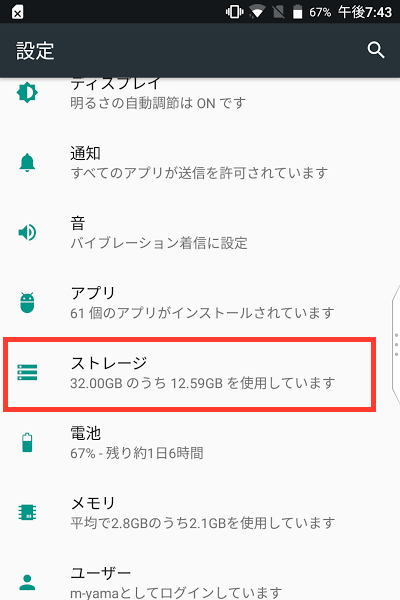
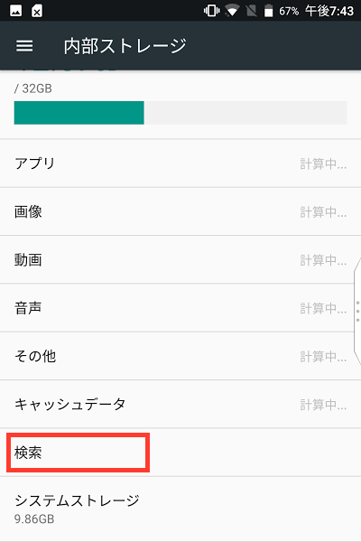
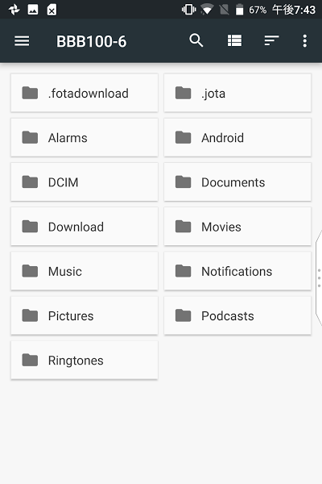

.. post:: Aug 12, 2017
   :tags: blackberry
   :category: blog

Blackberry KEYone 小ネタ集
==========================

Blackberry KEYone を使っていて発見した小ネタ。

目次
^^^^

.. contents::
   :local:

「検索」のショートカットについて
--------------------------------

デフォルトで *S* キー長押しに設定されている「検索」のショートカットですが、これを他の機能に変更したり削除してしまうと、今のところ元に戻せません。（変更してしまったので、戻す方法があれば教えてください）

ということで、「デバイスの検索」の機能で代用するか、Chromeを起動するようにして後述のショートカットキーでアドレスバーを選択して検索するかで対応したいと思います。

Chromeでアドレスバーを選択するショートカットキー
-------------------------------------------------

Chromeで、 ``alt + D`` を押すとアドレスバー選択することができる。

Chromeでメニューを表示するショートカットキー
----------------------------------------------

Chromeで、 ``alt + E`` か ``alt + F`` を押すとメニューを表示できる。

HUBのタブを移動する
--------------------

画面の右または左に表示される Blackberry HUB のタブは、長押しするとドラッグして位置を動かすことができる。

スクリーンショット
-------------------

「電源ボタン」と「ボリューム下げる」ボタンを **同時に** 押して、1秒ほど押し続けるとスクリーンショットを取ることができる。

ファイルエクスプローラー
------------------------

``設定 > ストレージ > 検索`` でファイルエクスプローラーを表示できる。

   

