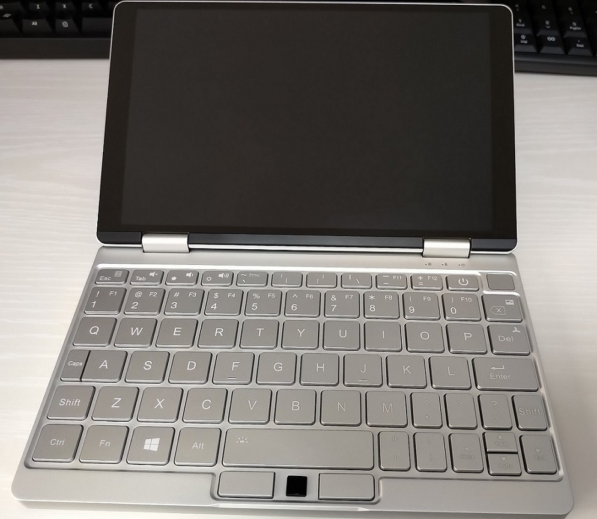

.. post:: 2019-08-15
   :tags: onemix
   :category: blog

OneMix3でCapsキーをIMEオン/オフキーに変更した
=============================================

.. |br| raw:: html

    

|img| |br|
USキーボードでは日本語・英語入力の切り替えは Alt + チルダ でできますが、
OneMix3はチルダが押しづらい位置にあるので、あまり使わないCapsキーをIMEオン・オフに変更しました。
Capsは死にますが、左手小指だけで日本語・英語の入力を切り替えられるようになって幸せです。

.. contents:: 手順
   :local:
   :depth: 1

１．CapsLockをF13キーに変更する
-------------------------------

レジストリに、以下の内容を追加。

*Caps_to_F13.reg*

.. code-block:: none

   Windows Registry Editor Version 5.00
   
   [HKEY_LOCAL_MACHINE\SYSTEM\CurrentControlSet\Control\Keyboard Layout]
   "Scancode Map"=hex:00,00,00,00,00,00,00,00,02,00,00,00,64,00,3a,00,00,00,00,00

PCを再起動。

２．F13キーにIMEオン・オフを割り当てる
--------------------------------------

   1. タスクバーのIMEを右クリック ＞ プロパティ
   2. 詳細設定を開く ＞ 編集操作の「変更」
   3. キー追加 ＞ F13 を選択して追加
   4. 追加した F13 を選択して「変更」ボタン ＞ IMEオン・オフを割り当てる

以上
