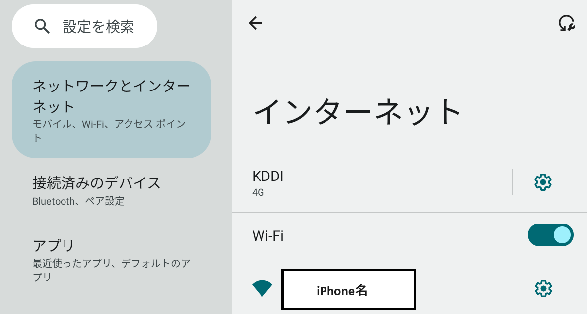
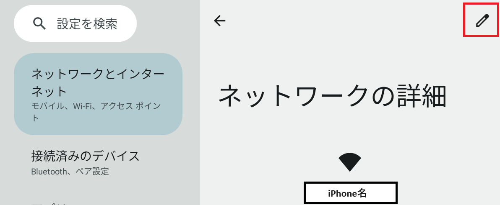
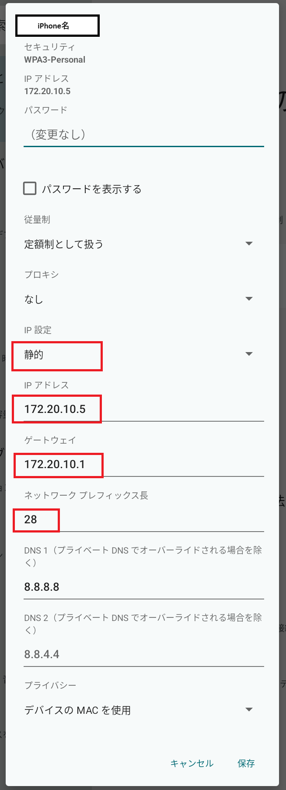

.. post:: 2024-05-24
   :tags: iphone android 
   :category: blog

iPhoneのテザリングにiPlay50 mini Proがつながらない場合の解決方法
==================================================================

iPlay50 mini Pro NFEからiPhoneのテザリングに接続しようとしたところ、iPhoneには繋がっているようだけどインターネットに接続できない、という状態だった。接続ステータスには「IP設定エラー」と表示されており、開発者オプションでWiFi詳細ログを有効にしたところ、「dhcp_failure=1」といったログが残っていたため、そのあたりで調べた。

環境
----

* iPhone 15 Pro (iOS 17.4.1)
* iPlay50 mini Pro NFE (Android 13)
* iPhoneのキャリアは楽天モバイル（Rakuten最強プラン）
* iPlay50はPovoのSIMを挿した状態。

現象
----

1. iPhoneのインターネット共有をONにする
2. iPlay50のWiFi設定でiPhoneのテザリングへ接続しようとするも、ネットに接続できない。
3. 他のAndroid端末からはiPhoneへ接続できる。
4. iPlay50から自宅のWiFiルーターへは接続できる。

原因
----

| `iphone hotspot dhcp not work` でググると、どうやらiOS17.2あたりからiPhoneテザリング時のDHCPまわりの仕様が変わったらしい。（IPv6のアドレスしか払いだされなくなった？）
| `My iPhone hotspot isn't working after updating to iOS 17.2 <https://discussions.apple.com/thread/255346180?sortBy=best>`_
|
| で、さらに、iPlay50がIPv6に対応していない？

解決方法
--------

iPlay50側で静的にIPv4アドレスを割り当てる。

   iPlay50の設定の「ネットワークとインターネット」から、iPhoneのSSIDを選択

   右上の編集アイコンを選択

   写真のように設定を行う

   1. IP設定を「静的」に変更する。
   2. IPアドレスを 172.20.10.x に設定（x は、たぶん 2～14 ならなんでも良いと思う）
   3. ゲートウェイを 172.20.10.1 に設定
   4. ネットワーク プレフィックス長を 28 に設定（最初は24でもつながりましたが、つながらないことがあったので28に変更したらつながった）
   5. その他は適宜環境に応じて設定

   上記設定でつながるようになりました。
